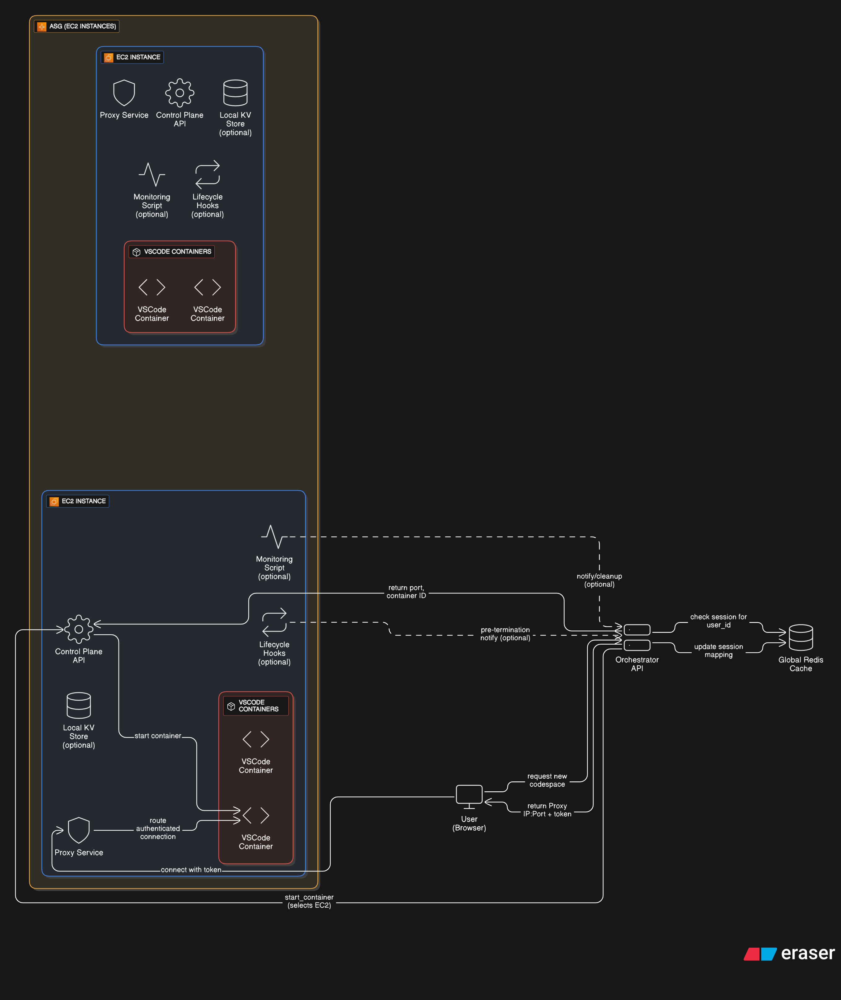

# What is this?
It is a vscode as a service similar to github codespaces. Mainly I built this for learning asgs, instance scaling and deployments
> The cdk stack for orchastrator  is not added since its mostly the api which can be simulated locally easily -> so only the metric server and control plane are deployable
# VSCode-as-a-Service Architecture

## 🧠 Overview
This is a self-hosted GitHub Codespaces-like system built for learning:
- Auto Scaling Groups (ASGs)
- Orchestration
- Container lifecycle
- Distributed deployments

---

## ✅ Components

### 1️⃣ Global Redis Cache (Used only by Orchestrator)

- **Purpose**:
  - Stores:
    - Container statuses (running/stopped)
    - User-to-container mappings
    - Instance/container load metadata
- **Used by**:
  - ✅ **Orchestrator only**
- **Why**:
  - Enables fast lookups without pinging EC2s
  - Keeps orchestrator logic stateless
- ❌ EC2s do NOT read/write to Redis

---

### 2️⃣ Auto Scaling Group (ASG) – Multiple EC2 Instances

Each EC2 instance runs:

#### 🧠 Control Plane API
- Receives container management requests from orchestrator
- Starts/stops VSCode containers
- Manages port assignment
- Updates orchestrator about state changes (idle, shutdown)

#### 🔐 Proxy Service
- Public-facing endpoint for users
- Authenticates users
- Routes to correct container using local KV

#### 📦 VSCode Containers
- Up to 20 containers per instance
- Docker-based, user-isolated environments

#### 🗂️ Local KV Store
- Maps:
  - `user_id → container_id`
  - `container_id → port, start_time`
  - `ports_pool -> ports available`
- Accessed by both proxy and control plane
> Reducing db calls using asg specific jwts - can be made stateless to get the port by passing asg specific jwt(different secrets) from the asg to the orchastrator and orchastrator will pass that token to the user.

#### 🔄 Monitoring Script(scheduled)
- Detects idle containers (15 min)
- Calls control plane to stop them
- Control plane informs orchestrator → orchestrator updates Redis
> Another good approach would be publishing an event consumed by both the orchastrator and machine control plane for updating the cache
---

### 3️⃣ Orchestrator API (Central Brain)

- Handles:
  - New user codespace requests
  - EC2 selection logic
  - Communicates with Control Planes on EC2s
  - Scales ASG if no EC2 has capacity
- Reads from:
  - ✅ Global Redis Cache
- Responsibilities:
  - Maintains internal state of EC2s
  - Updates Redis after container changes
  - Assigns users to existing containers or creates new ones
- Returns:
  - Proxy IP, container port, and access token to the user

---

### 4️⃣ EC2 to Orchestrator Communication

#### 🔁 Idle Cleanup
- EC2 monitor detects idle container
- Control plane stops the container
- Sends update to orchestrator
- Orchestrator updates Redis

#### 🔄 Lifecycle Hook (Optional for Production)
- EC2 instance termination triggers script
- Sends cleanup info to orchestrator
- Orchestrator removes user/container state from Redis

---

## ⚙️ Example Request Flow

1. **User → Orchestrator**: "Start codespace"
2. **Orchestrator**:
   - Checks Redis for existing session
   - Picks EC2 with capacity
   - Calls that EC2’s Control Plane: `start_container(user_id)`
3. **Control Plane**:
   - Starts VSCode container
   - Assigns port and updates local KV
   - Returns container info
4. **Orchestrator**:
   - Stores mapping in Redis: `{ user_id: { instance_id, port } }`
   - Returns proxy IP, port, token
5. **User → EC2 Proxy**:
   - Authenticates
   - Proxy routes to container based on local KV

---

## 🔍 Notes

- Only the orchestrator talks to the central Redis.
- EC2s maintain their own local state and interact via HTTP with the orchestrator.
- The system is designed for minimal coupling and efficient scaling.

